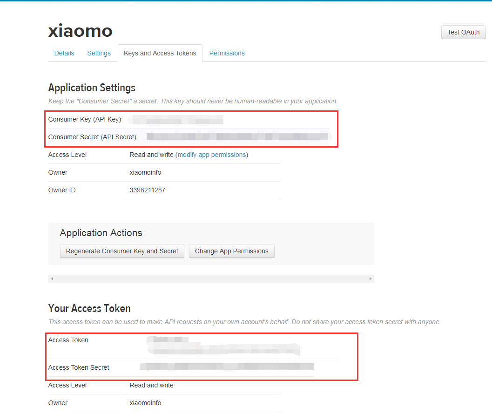
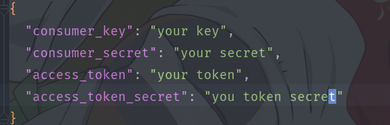
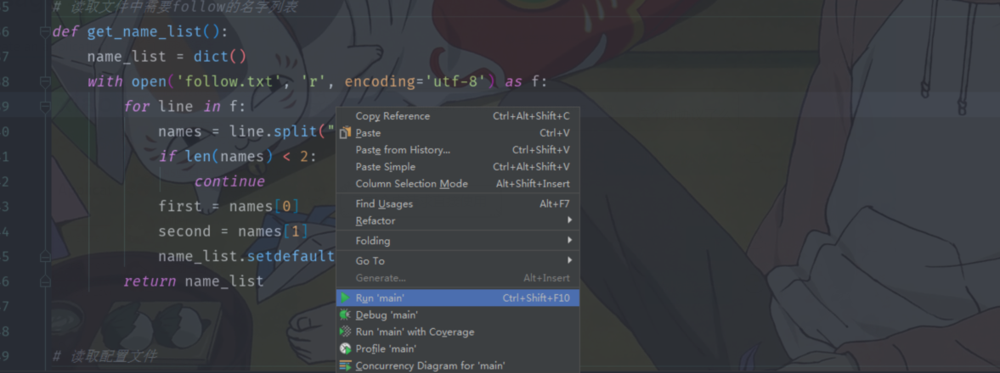

# Usage step 1
create an application at [application manager](https://apps.twitter.com/app/new), you will get the information that we need


# Usage step 2
open the file 'cfg.json', then update to yours

# Usage step 3
open the file 'main.py', then right click ,choose the `run` command, the application will be work


# change your follower
if you want to add or change followers, you can operate the file `follow.txt`


# Gold luck to you
if you have any question,please to concat me.

# license
```
MIT License

Copyright (c) 2018 Peng Hu

Permission is hereby granted, free of charge, to any person obtaining a copy
of this software and associated documentation files (the "Software"), to deal
in the Software without restriction, including without limitation the rights
to use, copy, modify, merge, publish, distribute, sublicense, and/or sell
copies of the Software, and to permit persons to whom the Software is
furnished to do so, subject to the following conditions:
```